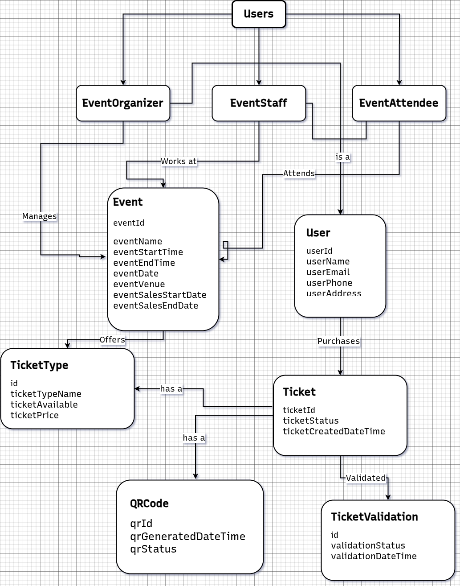

# Event-Ease

The **Event-Ease** is a Spring Boot backend solution designed to manage events, tickets, and ticket validation. It allows **Organizers** to create events, **Attendees** to purchase tickets, and **Event Staff** to validate tickets via QR code scanning. This platform also integrates **OAuth2** and **OpenID Connect** (OIDC) for secure authentication and authorization.

### Key Features
- **Organizer Dashboard**: Create, edit, and manage events and ticket sales
- **Attendee Portal**: Browse published events, purchase tickets, and access ticket details with QR codes
- **Event Staff Operations**: Scan QR codes for ticket validation during the event
- **JWT Authentication & Role-Based Authorization**: Manage access control for Organizers, Attendees, and Staff
- **Sales Reporting & Dashboard**: Generate sales metrics and reports

---

## Tech Stack
- **Backend Framework**: Java 17, Spring Boot 3.2.5
- **Security**: Spring Security, OAuth 2.0, OpenID Connect (OIDC) with Keycloak
- **Database**: PostgreSQL (Production), H2 (Testing)
- **ORM Tool**: Spring Data JPA
- **API**: Spring Web (REST API)
- **Authentication**: OAuth2 Resource Server, JWT tokens
- **Mapping**: MapStruct
- **Containerization**: Docker, Docker Compose
- **Code Simplification**: Lombok
- **Live Reload**: Spring Boot DevTools
- **API Documentation**: Swagger/OpenAPI
- **Build Tool**: Maven

---

## Dependencies Used

| Dependency                | Purpose                                  |
|---------------------------|------------------------------------------|
| **Spring Boot DevTools**   | Hot reload for development               |
| **Lombok**                 | Boilerplate code reduction               |
| **Spring Web**             | Building RESTful web services            |
| **PostgreSQL Driver**      | Database connectivity (production)       |
| **Spring Security**        | Securing APIs and endpoints              |
| **OAuth2 Resource Server** | Authentication with OAuth2/JWT           |
| **Spring Data JPA**        | ORM for database access                  |
| **H2 Database**            | In-memory database for testing           |

---

## Project Structure
```
src
 └── main
      ├── java
      │    └── com.example.eventplatform
      │         ├── controller
      │         ├── service
      │         ├── repository
      │         ├── model
      │         ├── security
      │         └── mapper
      └── resources
           ├── application.properties
           └── static/images/DomainModel_EBP.png
```

## Domain Model




---

## API Endpoints

### Organizer Endpoints

**Event Management**  
- **Create Event**:  
  `POST /api/v1/events`  
  Req body: `Event`  

- **Get All Events**:  
  `GET /api/v1/events`  
- **Retrieve Event**:  
  `GET /api/v1/events/{event_id}`  
- **Update Event**:  
  `PUT /api/v1/events/{event_id}`  
  Req body: `Event`  
- **Delete Event**:  
  `DELETE /api/v1/events/{event_id}`  

**Ticket Sales**  
- **List Ticket Sales**:  
  `GET /api/v1/events/{event_id}/tickets`  
- **Retrieve Ticket Sale**:  
  `GET /api/v1/events/{event_id}/tickets/{ticket_id}`  
- **Partially Update Ticket** (e.g., cancel)  
  `PATCH /api/v1/events/{event_id}/tickets`  
  Req body: partial `Event`  

**Ticket Types**  
- **List All Ticket Types**:  
  `GET /api/v1/events/ticket-types`  
- **List Ticket Types for Event**:  
  `GET /api/v1/events/{event_id}/ticket-types`  
- **Retrieve Ticket Type**:  
  `GET /api/v1/events/{event_id}/ticket-types/{ticket_type_id}`  
- **Partial Update Ticket Type**:  
  `PATCH /api/v1/events/{event_id}/ticket-types/{ticket_type_id}`  
  Req body: partial `Ticket Type`  
- **Delete Ticket Type**:  
  `DELETE /api/v1/events/{event_id}/ticket-types/{ticket_type_id}`  

---

### Attendee Endpoints
- **Search Published Events**:  
  `GET /api/v1/published-events`  
- **Retrieve Published Event**:  
  `GET /api/v1/published-event/{published_event_id}`  
- **Purchase Ticket**:  
  `POST /api/v1/published-event/{published_event_id}/ticket-types/{ticket_type_id}`  
- **Retrieve Purchased Tickets**:  
  `GET /api/v1/tickets`  
- **Retrieve Ticket Details**:  
  `GET /api/v1/ticket/{ticket_id}`  
- **Get Ticket QR Code**:  
  `GET /api/v1/tickets/{ticket_id}/qr-codes`  

---

### Event Staff Endpoints
- **Get All Events**:  
  `GET /api/v1/events`  
- **Validate Ticket (QR Scan or Code)**:  
  `POST /api/v1/events/{event_id}/ticket-validations`  
- **List Ticket Validations**:  
  `GET /api/v1/events/{event_id}/ticket-validations`  

---

## Authentication & Authorization
- **Authentication**: OAuth 2.0 / OIDC with **Keycloak**  
- **Authorization**: Role-Based Access Control (Roles: Organizer, Attendee, Staff)  
- **Token**: JWT issued by Keycloak upon login  

---

## Setup Instructions

### 1. Clone the Repository
```bash
git clone https://github.com/your-username/event-ticket-platform.git
cd event-ticket-platform
```

### 2. Start PostgreSQL & Keycloak  
```bash
docker compose up -d
```

### 3. Configure Spring Boot  
In `src/main/resources/application.properties`:
```properties
spring.datasource.url=jdbc:postgresql://localhost:5432/postgres
spring.datasource.username=postgres
spring.datasource.password=your_own_password
spring.jpa.hibernate.ddl-auto=update
spring.jpa.show-sql=true
```

### 4. Run the Application  
```bash
./mvnw spring-boot:run
```

### 5. Access Swagger UI  
Visit: `http://localhost:8080/swagger-ui/index.html`

---

## Future Improvements
- Integrate a payment gateway (e.g., Stripe)  
- Add email/SMS notifications  
- Build a rich analytics dashboard  

---

## License
This project is licensed under the MIT License.


---

## Author
**Your Name**  
[GitHub](https://github.com/karkiayush) • [LinkedIn](https://www.linkedin.com/in/aayush-karki-18b18221a/)

---

